# ERD — NextTime Database

> File ini di-update otomatis setiap kali ada perubahan struktur database (migrasi baru/ubah). Mencerminkan skema **saat ini** (bukan rencana). Untuk rencana tabel yang akan ditambahkan, lihat [`RENCANA-PENGEMBANGAN.md`](./RENCANA-PENGEMBANGAN.md) §4.

**Terakhir diperbarui**: 2026-08-19 (setelah Fase 1 + Fase 2 + Iterasi 11 opsional — seluruh rencana selesai)
**Database**: MySQL — `nexttime` (lihat `.env`)

---

## Skema Saat Ini

```mermaid
erDiagram
    USERS {
        bigint id PK
        string name
        string email UK
        timestamp email_verified_at
        string password
        string role "user | admin, default user"
        string remember_token
        timestamps timestamps
    }

    SETTINGS {
        bigint id PK
        string group "contoh: contact, wa_widget, site, sections, why_us"
        string key
        text value "nullable"
        string type "text | textarea | image | boolean | url"
        timestamps timestamps
    }

    HERO_SLIDES {
        bigint id PK
        string badge
        string title
        string title_highlight "nullable"
        text description
        string primary_cta_text
        string primary_cta_link
        string secondary_cta_text "nullable"
        string secondary_cta_link "nullable"
        boolean is_active
        unsignedInt sort_order
        timestamps timestamps
    }

    SERVICES {
        bigint id PK
        string icon "nama ikon Lucide"
        string title
        text description
        boolean is_active
        unsignedInt sort_order
        timestamps timestamps
    }

    PRICING_PACKAGES {
        bigint id PK
        string name
        string tier "silver | gold | diamond | custom"
        string icon "nama ikon Lucide"
        string price_prefix "mulai dari | harga"
        string price_amount "contoh: 800 atau Fleksibel"
        string price_unit "nullable, contoh: rb"
        json features "nullable"
        string cta_text
        string cta_link
        boolean is_best_seller
        boolean is_active
        unsignedInt sort_order
        timestamps timestamps
    }

    PROJECTS {
        bigint id PK
        string slug UK
        string title
        string tag
        string category "umkm | company-profile | landing-page"
        string status "available | soon"
        string mockup_type "resto | shop | company | null"
        string thumbnail_path "nullable, upload gambar asli — fallback ke mockup CSS bila kosong"
        string icon "nullable"
        text summary
        text overview "nullable"
        json features "nullable"
        boolean featured
        unsignedInt sort_order
        timestamps timestamps
    }

    WHY_US_ITEMS {
        bigint id PK
        string icon "nama ikon Lucide"
        string title
        text description
        boolean is_active
        unsignedInt sort_order
        timestamps timestamps
    }

    CLIENTS {
        bigint id PK
        string name
        string icon "nullable, nama ikon Lucide (fallback)"
        string logo_path "nullable, upload logo"
        boolean is_active
        unsignedInt sort_order
        timestamps timestamps
    }

    GALLERY_ITEMS {
        bigint id PK
        string title
        string image_path
        string size_variant "normal | wide | tall"
        boolean is_active
        unsignedInt sort_order
        timestamps timestamps
    }

    CONTACT_MESSAGES {
        bigint id PK
        string name
        string email
        string phone "nullable"
        string service_interest "nullable"
        text message
        string status "new | read | replied, default new"
        timestamps timestamps
    }
```

Tabel Laravel standar yang juga ada (tidak relevan untuk domain aplikasi, tidak digambarkan di atas): `password_reset_tokens`, `sessions`, `cache`, `cache_locks`, `jobs`, `job_batches`, `failed_jobs`.

**Catatan relasi**: belum ada foreign key antar tabel domain (`hero_slides`, `services`, `pricing_packages`, `projects`, `why_us_items`, `clients`, `gallery_items`, `contact_messages`, `settings` semuanya independen — tidak ada `created_by`/`author_id`).

**Grup `settings` yang sudah dipakai**: `why_us` (gambar & CTA "Kenapa Kami"), `contact` (info kontak publik), `wa_widget` (nomor WA, pesan default, konten promo), `site` (nama situs, logo, deskripsi footer, link sosial), `sections` (9 switch tampil/sembunyikan section halaman utama: `hero`, `layanan`, `paket_harga`, `kenapa`, `portofolio`, `klien`, `galeri`, `kontak`, `wa_widget`).

**Catatan penyimpanan file**: `clients.logo_path`, `gallery_items.image_path`, dan `projects.thumbnail_path` menyimpan path relatif di disk `public` (`storage/app/public/...`), diakses publik via symlink `public/storage` → URL `asset('storage/'.$path)`. Setting `why_us.cta_image` dan `site.logo_light`/`site.logo_dark` (di tabel `settings`) memakai pola yang sama.

---

## Riwayat Perubahan Skema

| Tanggal | Iterasi | Perubahan |
|---|---|---|
| 2026-08-19 | — | Baseline awal dicatat (belum ada perubahan skema) |
| 2026-08-19 | 0 | Tambah kolom `users.role`; tabel baru `settings` |
| 2026-08-19 | 1 | Tabel baru `hero_slides` |
| 2026-08-19 | 2 | Tabel baru `services` |
| 2026-08-19 | 3 | Tabel baru `pricing_packages` |
| 2026-08-19 | 4 | Tabel baru `why_us_items` |
| 2026-08-19 | 5 | — (tidak ada perubahan skema, hanya poles CRUD Portofolio) |
| 2026-08-19 | 6 | Tabel baru `clients` |
| 2026-08-19 | 7 | Tabel baru `gallery_items` |
| 2026-08-19 | 8 | Tabel baru `contact_messages` |
| 2026-08-19 | 9 | — (tidak ada perubahan skema, hanya grup `settings` baru: `wa_widget`) |
| 2026-08-19 | 10 | — (tidak ada perubahan skema, hanya grup `settings` baru: `site` & `sections`) |
| 2026-08-19 | Fase 2 / A | — (tidak ada perubahan skema) |
| 2026-08-19 | Fase 2 / B | — (tidak ada perubahan skema) |
| 2026-08-19 | Fase 2 / C | Tambah kolom `projects.thumbnail_path` |
| 2026-08-19 | 11 (opsional) | — (tidak ada perubahan skema, memanfaatkan `users.role` yang sudah ada sejak Iterasi 0) |

---

## Tabel Direncanakan (belum dibuat)

Tidak ada. Seluruh item di `RENCANA-PENGEMBANGAN.md` — Fase 1 (Admin Panel), Fase 2 (rapikan halaman publik), dan Iterasi 11 opsional (CRUD Pengguna) — sudah selesai dikerjakan per 2026-08-19. Kebutuhan skema baru berikutnya hanya akan muncul dari permintaan pengembangan baru di luar rencana awal ini.
